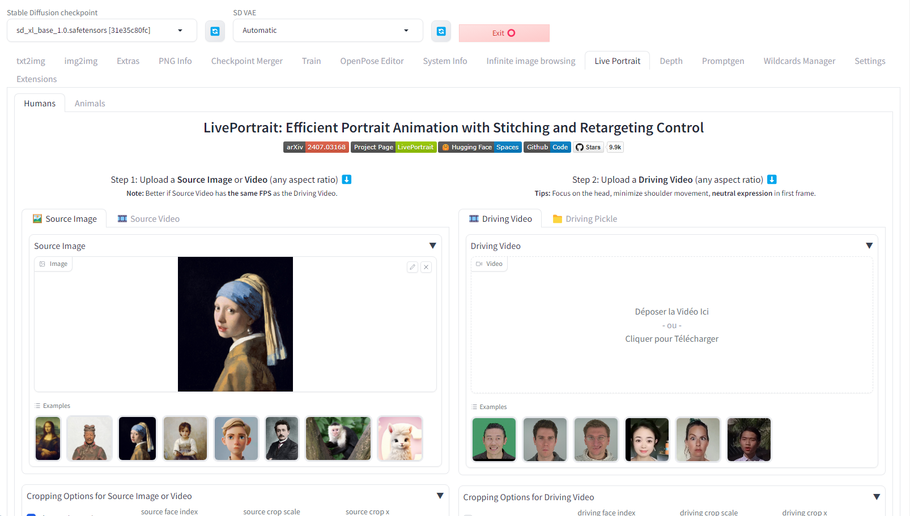

# LivePortrait for Stable Diffusion WebUI

This extension is for AUTOMATIC1111's [Stable Diffusion web UI](https://github.com/AUTOMATIC1111/stable-diffusion-webui), it allows to add a [LivePortrait](https://github.com/KwaiVGI/LivePortrait) tab to the original Stable Diffusion WebUI to benefit from LivePortrait features.



## Installation

> [!Note]
> Make sure your system has [`FFmpeg`](https://ffmpeg.org/download.html) installed. For details on FFmpeg installation, see [**how to install FFmpeg**](assets/docs/how-to-install-ffmpeg.md).

1. Open "Extensions" tab.
1. Open "Install from URL" tab in the tab.
1. Enter https://github.com/dimitribarbot/sd-webui-live-portrait.git to "URL for extension's git repository".
1. Press "Install" button.
1. It may take a few minutes to install. XPose will be compiled and InsightFace, XPose and LivePortrait models should be downloaded. At the end, you will see the message "Installed into stable-diffusion-webui\extensions\sd-webui-live-portrait. Use Installed tab to restart".
1. Go to "Installed" tab, click "Check for updates", and then click "Apply and restart UI". (The next time you can also use these buttons to update this extension.)

### /!\ Important notes /!\

XPose, the face detector model used for animal mode, is currently not working with MacOS and is not compatible with pytorch version 2.1.x which is the default version of today's Automatic1111 version v1.10.1. To allow animal mode to work correctly, you must downgrade your pytorch version to v2.0.1 and use cuda v1.18.  

To do that you can open the `stable-diffusion-webui/webui-user.sh` file (for Linux users) or `stable-diffusion-webui/webui-user.bat` (for Windows users) and make the following changes:

For Linux users, if you're using `xformers`, adjust or add the following lines (if you're not using `xformers`, remove the `--xformers` flag in `COMMANDLINE_ARGS` and remove the `XFORMERS_PACKAGE` line):
```
export COMMANDLINE_ARGS="--skip-version-check --xformers"
export TORCH_COMMAND="pip install torch==2.0.1+cu118 torchvision==0.15.2+cu118 --extra-index-url https://download.pytorch.org/whl/cu118"
export XFORMERS_PACKAGE="xformers==0.0.22"
```

For Windows users, replace all `export` with `set` at the beginning of each line.

As we have downgraded the pytorch version, to avoid unnecessary warnings at each launch of Automatic1111, we add the `--skip-version-check` flag to the command line arguments.

After these modifications, close Stable Diffusion WebUI if not done and restart it using the flags `--reinstall-torch` and `--reinstall-xformers` (if you're using `xformers`). These flags can then be removed for subsequent lanches of Automatic1111.

If everything went well, you should be able to use animal mode in the `Live Portrait` tab.

## Output

Generated files can be found in the `stable-diffusion-webui/outputs/live-portrait` folder.

## Models

### LivePortrait

Model files go here (automatically downloaded if the folder is not present during install): `stable-diffusion-webui/models/liveportrait` (human) and `stable-diffusion-webui/models/liveportrait_animals` (animals).  

If necessary, pickle files have all been converted to safetensors by Kijai. They can be downloaded from: https://huggingface.co/Kijai/LivePortrait_safetensors/tree/main (thanks to him).  

### Face detectors
For human mode, this extension is using Insightface, which is strictly for NON-COMMERCIAL use. Insightface models go here (automatically downloaded if the folder is not present during install): `stable-diffusion-webui/models/insightface/models/buffalo_l`.  

If necessary, they can be downloaded from: https://github.com/deepinsight/insightface/releases/download/v0.7/buffalo_l.zip.

For animal mode, this extension is using XPose which is also strictly for NON-COMMERCIAL use and is not compatible with MacOS. XPose model goes here (automatically downloaded if not present duing install): `stable-diffusion-webui/models/liveportrait_animals`.  

If necessary, it can be downloaded from: https://huggingface.co/KwaiVGI/LivePortrait/resolve/main/liveportrait_animals/xpose.pth.

## API
2 routes have been added to the Automatic1111 API:
- `/live-portrait/human`: inference for humans.
- `/live-portrait/animal`: inference for animals (not available for MacOS users).

Parameters are the same as LivePortrait ones (see output of command `python inference.py --help` in LivePortrait repository) except for:
- `source`: it can either be a path to an existing file (as in LivePortrait) or an url or a base64 encoded string. For url without file extension or base64 encoded string, the parameter `source_file_extension` must also be filled with a valid extension corresponding to the given source (e.g. `.jpg`).
- `driving`: it can either be a path to an existing file (as in LivePortrait) or an url or a base64 encoded string. For url without file extension or base64 encoded string, the parameter `driving_file_extension` must also be filled with a valid extension corresponding to the given driving video (e.g. `.mp4`).
- `send_output`: `true` if you want output videos to be sent as base64 encoded strings, `false` otherwise.
- `save_output`: `true` if you want output videos to be saved in `output_dir` (as in LivePortrait), `false` otherwise.  

## Roadmap

- [x] Add tabs with LivePortrait interface
- [x] Add inference API endpoints
- [ ] Option to use MediaPipe as face detector for humans
- [ ] Add retargetting API endpoints

## Thanks
Original author's link: https://liveportrait.github.io/

This project uses a model converted by kijai: https://github.com/kijai/ComfyUI-LivePortraitKJ