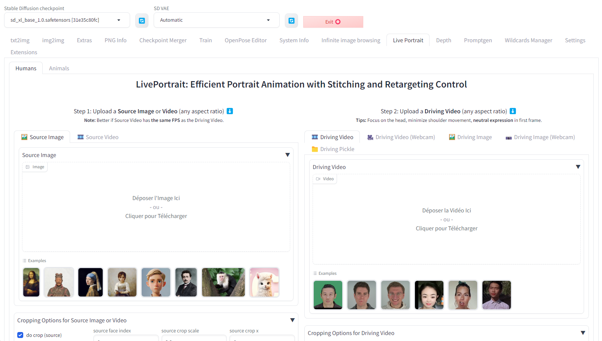
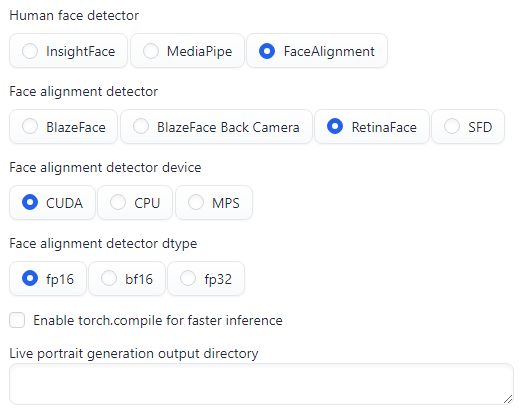

# LivePortrait for Stable Diffusion WebUI

This extension is for AUTOMATIC1111's [Stable Diffusion web UI](https://github.com/AUTOMATIC1111/stable-diffusion-webui), it allows to add a [LivePortrait](https://github.com/KwaiVGI/LivePortrait) tab to the original Stable Diffusion WebUI to benefit from LivePortrait features.

## Installation

> [!Note]
> Make sure your system has [`FFmpeg`](https://ffmpeg.org/download.html) installed. For details on FFmpeg installation, see [**how to install FFmpeg**](assets/docs/how-to-install-ffmpeg.md).

1. Open "Extensions" tab.
1. Open "Install from URL" tab in the tab.
1. Enter https://github.com/dimitribarbot/sd-webui-live-portrait.git to "URL for extension's git repository".
1. Press "Install" button.
1. It may take a few minutes to install as XPose may be compiled. At the end, you will see the message "Installed into stable-diffusion-webui\extensions\sd-webui-live-portrait. Use Installed tab to restart".
1. Go to "Installed" tab, click "Check for updates", and then click "Apply and restart UI". (The next time you can also use these buttons to update this extension.)

### /!\ Important notes /!\

XPose, the face detector model used for animal mode, is currently not working with MacOS or non NVIDIA graphic cards. To allow animal mode to work correctly, follow the instructions described [here](assets/docs/how-to-install-xpose.md).

## Output

By default, generated files can be found in the `stable-diffusion-webui/outputs/live-portrait` folder. It can be overriden in Automatic1111's SD WebUI settings (see section below).

## Settings

In the Automatic1111's SD WebUI settings tab, under the Live Portrait section, you can find the following configuration settings:

- `Human face detector` (`live_portrait_human_face_detector` entry in `config.json`): configures the face detector model for human inference, either the default original InsightFace, MediaPipe or Face Alignment.
- `Face alignment detector` (`live_portrait_face_alignment_detector` entry in `config.json`): configures the face detector model for human inference when using Face Alignment.
- `Face alignment detector device` (`live_portrait_face_alignment_detector_device` entry in `config.json`): configures the face detector model device for human inference when using Face Alignment.
- `Face alignment detector dtype` (`live_portrait_face_alignment_detector_dtype` entry in `config.json`): configures the face detector model dtype for human inference when using Face Alignment.
- `Enable torch.compile for faster inference` (`live_portrait_flag_do_torch_compile` entry in `config.json`): the first-time inference triggers an optimization process (about one minute), making subsequent inferences 20-30% faster. Performance gains may vary with different CUDA versions.
- `Live portrait generation output directory` (`live_portrait_output_dir` entry in `config.json`): configures the inference output directory. Defaults to `stable-diffusion-webui/outputs/live-portrait` if left empty.

## Models

### LivePortrait

Model files go here (automatically downloaded if the folder is not present during first run): `stable-diffusion-webui/models/liveportrait` (human) and `stable-diffusion-webui/models/liveportrait_animals` (animals).  

Pickle files have all been converted to safetensors by Kijai. If necessary, they can be downloaded from: https://huggingface.co/Kijai/LivePortrait_safetensors/tree/main (thank you Kijai).  

### Face detectors
For human mode, you can either use the original default [Insightface](https://github.com/deepinsight/insightface), or [Google's MediaPipe](https://github.com/google-ai-edge/mediapipe), or [Face Alignment](https://github.com/1adrianb/face-alignment) (see [Settings](#settings) section above or [API](#api) section below). 

Biggest difference is the license: Insightface is strictly for NON-COMMERCIAL use. MediaPipe is a bit worse at detection, and can't run on GPU in Windows, though it's much faster on CPU compared to Insightface. Face Alignment can use blazeface back camera model (or SFD or RetinaFace), it's far better for smaller faces than MediaPipe, that only can use the blazeface short model. The warmup on the first run when using this can take a long time, but subsequent runs are quick.

Insightface models go here (automatically downloaded if the folder is not present during first run): `stable-diffusion-webui/models/insightface/models/buffalo_l`. If necessary, they can be downloaded from: https://github.com/deepinsight/insightface/releases/download/v0.7/buffalo_l.zip.

For animal mode, this extension is using XPose which is also strictly for NON-COMMERCIAL use and is not compatible with MacOS. XPose model goes here (automatically downloaded if not present during first run): `stable-diffusion-webui/models/liveportrait_animals`.  

If necessary, it can be downloaded from: https://huggingface.co/KwaiVGI/LivePortrait/resolve/main/liveportrait_animals/xpose.pth.

## API
Routes have been added to the Automatic1111's SD WebUI API:
- `/live-portrait/human`: inference for humans.
- `/live-portrait/human/retargeting/image`: retargeting for human portraits. Supports an array of input parameters to generate multiple result images.
- `/live-portrait/human/retargeting/image/init`: get retargeting lip ratio and eye ratio of human portraits.
- `/live-portrait/human/retargeting/video`: retargeting for human videos.
- `/live-portrait/animal`: inference for animals (not available for MacOS users or for v2.1.x pytorch versions).

Parameters are the same as LivePortrait ones (see output of command `python inference.py --help` in LivePortrait repository) except for:
- `source`: it can either be a path to an existing file (as in LivePortrait) or an url or a base64 encoded string. For url without file extension or base64 encoded string, the parameter `source_file_extension` must also be filled with a valid extension corresponding to the given source (e.g. `.jpg`).
- `driving`: it can either be a path to an existing file (as in LivePortrait) or an url or a base64 encoded string. For url without file extension or base64 encoded string, the parameter `driving_file_extension` must also be filled with a valid extension corresponding to the given driving video (e.g. `.mp4`).
- `output_mode`: `video` or `images` whether to generate an output video (the original version of LivePortrait) or multiple images at given frame indices (see frame_indices)
- `frame_indices`: list of frame indices (1-based) where image snapshots should be generated (to be used with the 'images' output mode).
- `send_output`: `true` if you want output videos to be sent as base64 encoded strings, `false` otherwise.
- `save_output`: `true` if you want output videos to be saved in `output_dir` (as in LivePortrait), `false` otherwise.
- `use_model_cache`: `true` if you want live portrait and face detector models to be cached for subsequent calls using same models, `false` otherwise.
- `human_face_detector`: `insightface`, `mediapipe` or `facealignment`. Face detector to be used by human inference. Default to the `Human face detector` UI setting if defined or `insightface` if not set neither in settings nor in endpoint body.
- `face_alignment_detector`: `blazeface`, `blazeface_back_camera`, `retinaface` or `sfd`. Face detector to be used by human inference when Face Alignment is selected as `human_face_detector`. Default to the `Face alignment detector` UI setting if defined or `blazeface_back_camera` if not set neither in settings nor in endpoint body.
- `face_alignment_detector_device`: `cuda`, `cpu` or `mps`. Device to be used by face detector when Face Alignment is selected as `human_face_detector`. Default to `cuda`.
- `face_alignment_detector_dtype`: `fp16`, `bf16` or `fp32`. Device type to be used by face detector when Face Alignment is selected as `human_face_detector`. Default to `fp16`.
- `source_face_index`: Face index (0-based) to be cropped in the source image or video if `flag_do_crop` is set to `True`.
- `driving_face_index`: Face index (0-based) to be cropped in the driving video if `flag_crop_driving_video` is set to `True`.

Additional parameters for the `/live-portrait/human/retargeting/image` endpoint are:
- `retargeting_options`: an array of objects with the following arguments:
    - `eye_ratio`: target eyes-open ratio (0 -> 0.8)
    - `lip_ratio`: target lip-open ratio (0 -> 0.8)
    - `head_pitch_variation`: relative pitch (-15 -> 15)
    - `head_yaw_variation`: relative yaw (-25 -> 25)
    - `head_roll_variation`: relative roll (-15 -> 15)
    - `mov_x`: x-axis movement (-0.19 -> 0.19)
    - `mov_y`: y-axis movement (-0.19 -> 0.19)
    - `mov_z`: z-axis movement (0.9 -> 1.2)
    - `lip_variation_pouting`: pouting (-0.09 -> 0.09)
    - `lip_variation_pursing`: pursing 😐 (-20 -> 15)
    - `lip_variation_grin`: grin 😁 (0 -> 15)
    - `lip_variation_opening`: lip close <-> open (-90 -> 120)
    - `smile`: smile 😄 (-0.3 -> 1.3)
    - `wink`: wink 😉 (0 -> 39)
    - `eyebrow`: eyebrow 🤨 (-30 -> 30)
    - `eyeball_direction_x`: eye gaze (horizontal) 👀 (-30 -> 30)
    - `eyeball_direction_y`: eye gaze (vertical) 🙄 (-63 -> 63)
- `retargeting_source_scale`: the ratio of face area is smaller if scale is larger
- `flag_stitching_retargeting_input`: To apply stitching or not
- `flag_do_crop_input_retargeting_image`: whether to crop the source portrait to the face-cropping space

Additional parameters for the `/live-portrait/human/retargeting/image/init` endpoint are:
- `eye_ratio`: target eyes-open ratio (0 -> 0.8)
- `lip_ratio`: target lip-open ratio (0 -> 0.8)
- `retargeting_source_scale`: the ratio of face area is smaller if scale is larger

Additional parameters for the `/live-portrait/human/retargeting/video` endpoint are:
- `lip_ratio`: target lip-open ratio (0 -> 0.8)
- `retargeting_source_scale`: the ratio of face area is smaller if scale is larger
- `driving_smooth_observation_variance_retargeting`: motion smooth strength
- `video_retargeting_silence`: whether to keep the lip silent
- `flag_do_crop_input_retargeting_video`: whether to crop the source video to the face-cropping space

## Thanks
Original author's link: https://liveportrait.github.io/

This project has been inspired and uses models converted by kijai: https://github.com/kijai/ComfyUI-LivePortraitKJ