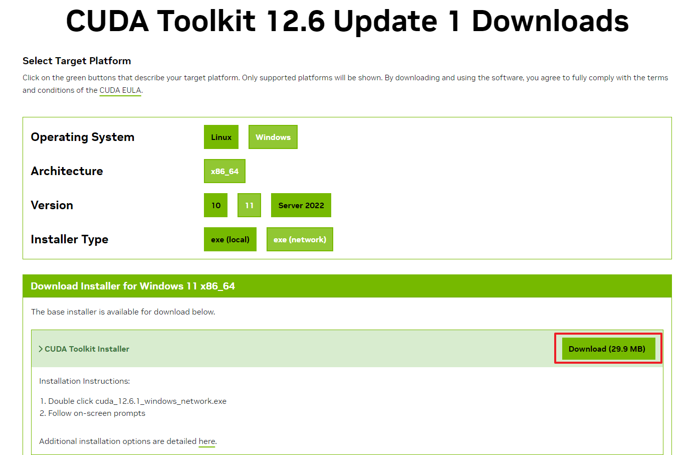
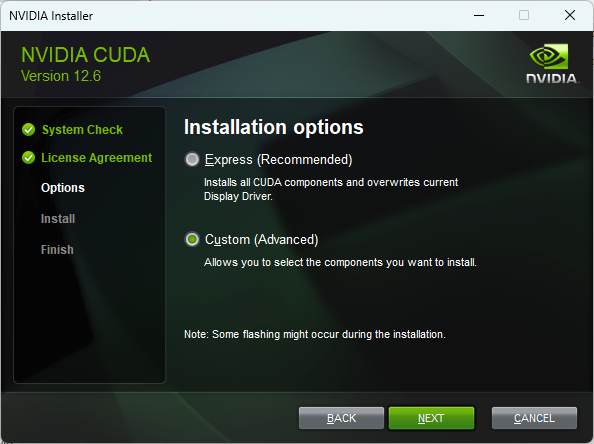
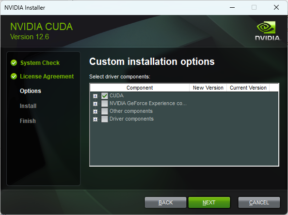
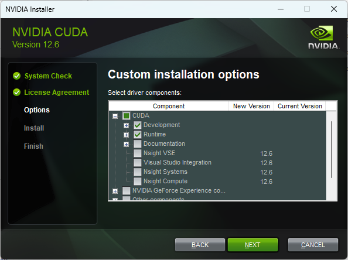
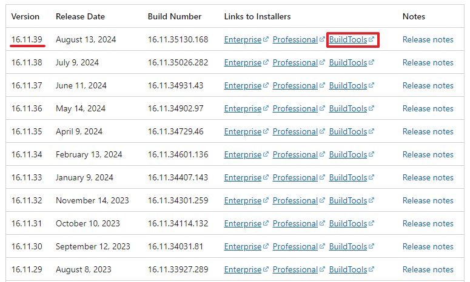
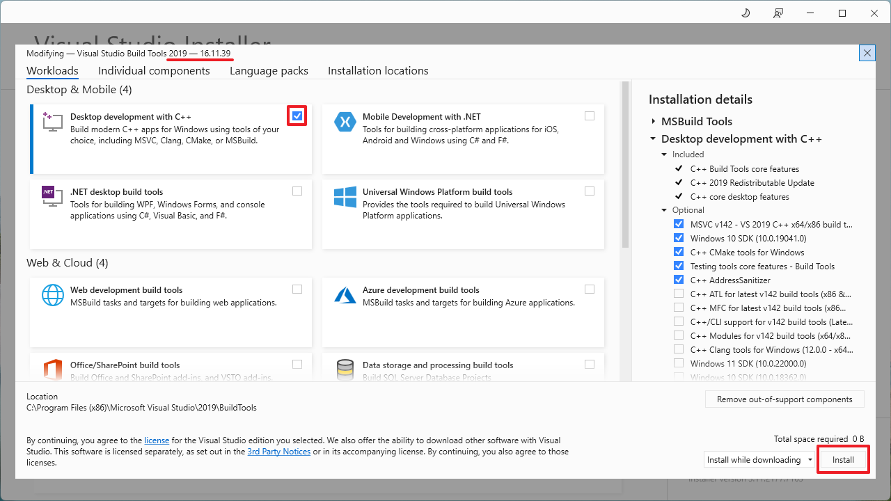
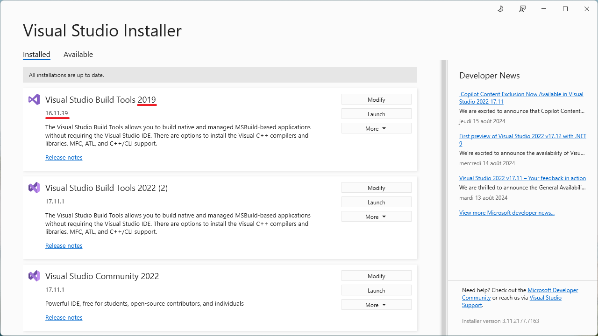
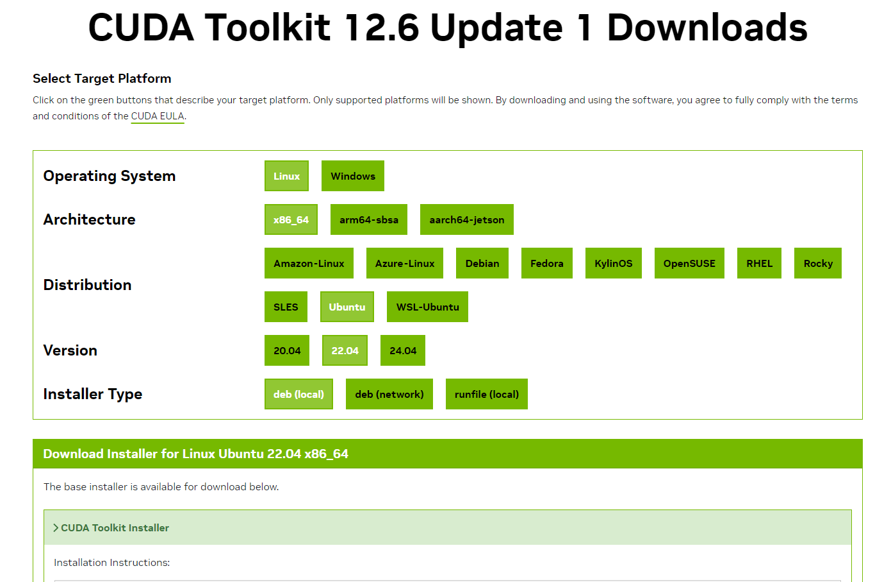
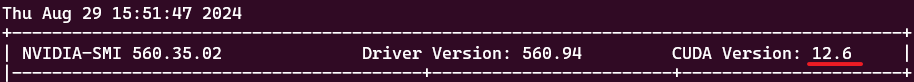

# Install XPose

XPose, the face detector model used for animal mode, is currently not working with MacOS or non NVIDIA graphic cards.  

You can find here the procedure to install XPose on your computer.

## Windows Users

### CUDA Toolkit

First, you need to install a CUDA Toolkit compatible with your PyTorch installation. **The major version of the CUDA Toolkit you'll choose to install must match the one that PyTorch used to build its binaries.** By default, today's Automatic1111's SD WebUI version 1.10.1 is using a PyTorch module built using CUDA v12.1. Therefore, you need to install a CUDA Toolkit v12.x minimum.  

Note that the CUDA Toolkit you can choose depends on your NVIDIA driver version. You can refer to this [CUDA Toolkit and Corresponding Driver Versions](https://docs.nvidia.com/cuda/cuda-toolkit-release-notes/index.html#id5) compatibility table provided by NVIDIA. To find your installed driver version, you can follow the procedure in the FAQ under the question ["Q: How can I find out what driver version I have?"](https://www.nvidia.com/en-gb/drivers/drivers-faq/). You may need to [update your drivers](https://www.nvidia.com/en-us/drivers/) if you want to install a newer version of CUDA Toolkit.  

Go to [NVIDIA CUDA Toolkit Archives](https://developer.nvidia.com/cuda-toolkit-archive) page and select the right CUDA Toolkit version. Then, on the following page, select your operating system configuration. You can either choose "exe (local)" or "exe (network)" but the latter will be faster as you don't need to install all NVIDIA packages. Download the installer and execute it.



When asked, choose custom install:



Then in the following dialog, unselect everything except "CUDA":



Finally, under "CUDA", only select "Development" and "Runtime" and click "Next":



Click "Next" and "Finish" to end CUDA Toolkit installation.

### Microsoft Visual Studio Build Tools

Then, you need to have the proper installation of the Microsoft Visual Studio Build Tools. Go to [Visual Studio 2019 Release History](https://learn.microsoft.com/en-us/visualstudio/releases/2019/history#release-dates-and-build-numbers) and download the Build Tools corresponding to the latest version:  



> [!NOTE]
> Note that more recent versions of the Build Tools (Visual Studio 2022 17.10 and above) are not compatible with CUDA Toolkit below v12.4. Even if you already have Visual Studio 2022 Build Tools installed you still have to download and install the 2019 version if you're CUDA Toolkit version is v12.3 or below.  

> [!WARNING]
> If you're following this tutorial out of the Automatic1111's WebUI extension installation context and have a version of CUDA Toolkit strictly below v12.4, ensure to uninstall all previous installations of Visual Studio 2022 Build Tools 17.10 or newer, otherwise the procedure will fail.  

In the installation dialog, select "Desktop development with C++" as shown in the image below (ensure that the version to be installed is the correct one) and click "Install":



At the end of the installation procedure, you should see a screen like the following:



## Linux Users

### GCC

Verify that you have `gcc` correctly installed by running the following command in a terminal:
```
gcc --version
```
If an error message displays, you need to install the development tools from your Linux distribution or obtain a version of gcc and its accompanying toolchain from the Web.

### CUDA Toolkit

Then, you need to install a CUDA Toolkit compatible with your PyTorch installation. **The major version of the CUDA Toolkit you'll choose to install must match the one that PyTorch used to build its binaries.** By default, today's Automatic1111's SD WebUI version 1.10.1 is using a PyTorch module built using CUDA v12.1. Therefore, you need to install a CUDA Toolkit v12.x minimum.  

Note that the CUDA Toolkit you can choose depends on your NVIDIA driver version. You can refer to this [CUDA Toolkit and Corresponding Driver Versions](https://docs.nvidia.com/cuda/cuda-toolkit-release-notes/index.html#id5) compatibility table provided by NVIDIA. To find your installed driver version, you can run a `nvidia-smi` command in a terminal. You may need to [update your drivers](https://www.nvidia.com/en-us/drivers/) if you want to install a newer version of CUDA Toolkit.  

Go to [NVIDIA CUDA Toolkit Archives](https://developer.nvidia.com/cuda-toolkit-archive) page and select the right CUDA Toolkit version. Then, on the following page, select your operating system configuration. You can choose any of the "Installer Type" but note that you only need the CUDA Toolkit SDK to be installed, you can skip the driver installation if you've already done it.



At the end of the installation procedure, add the correct version of CUDA Toolkit to your PATH environment variable as described [here](https://docs.nvidia.com/cuda/cuda-installation-guide-linux/index.html#environment-setup) by replacing latest version of CUDA in folder paths if necessary.

## WSL Users (Windows Subsystem for Linux)

The installation procedure is the same as for Linux users, except that you need to select `WSL-Ubuntu` in the CUDA Toolkit installation step. More information on how to install CUDA when using WSL can be found [here](https://docs.nvidia.com/cuda/wsl-user-guide/index.html).

> [!Note]
> Verify the CUDA version used by your system by running the `nvidia-smi` command in a terminal. If you have CUDA 12.x as screenshot below and you're using PyTorch built using CUDA v11.8, you will need both CUDA Toolkit 11.8 and CUDA Toolkit 12.x to be installed in WSL. However, your environment variables should still points to the 11.8 CUDA version. Not installing CUDA Toolkit 12.x may lead to errors with onnxruntime-gpu during Live Portrait inference. You can find the CUDA Toolkit corresponding to your `nvidia-smi` version [here](https://developer.nvidia.com/cuda-toolkit-archive).



## Installation logs

The building of the XPose OP dependency adds some logs in the extension folder, by default in the `stable-diffusion-webui/extensions/sd-webui-live-portrait/logs` directory. If an error occurs during the extension installation, you may find useful information in the log files written in this folder.

## Reinstall XPose

To not impact performance when launching WebUI, by default we do not retry XPose installation in case of failure. To force XPose reinstall, you can:
- either restart your SD WebUI and then go to the "Live Portrait" tab and in the "Animals" sub-tab click on the "Reinstall XPose and Restart WebUI" button (only visible if previous installation of XPose has failed),
- or manually delete the `liveportrait/utils/dependencies/XPose/models/UniPose/ops/lib` folder in the extension folder, which is by default `stable-diffusion-webui/extensions/sd-webui-live-portrait` (in that case, folder to remove is `stable-diffusion-webui/extensions/sd-webui-live-portrait/liveportrait/utils/dependencies/XPose/models/UniPose/ops/lib`) and restart your SD WebUI.  

In case this procedure is not working, you can try the [following one](./how-to-install-xpose-old.md) by downgrading your CUDA Toolkit to v11.8.