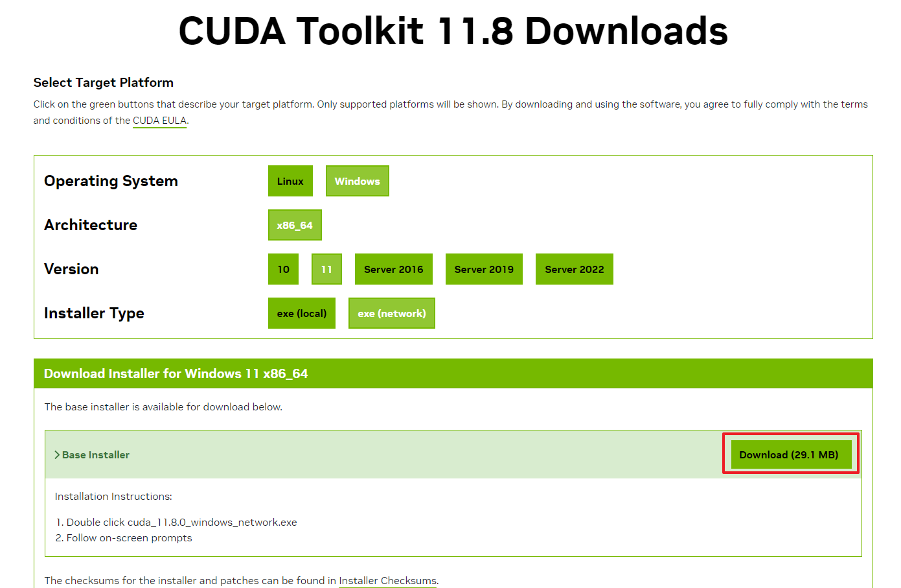
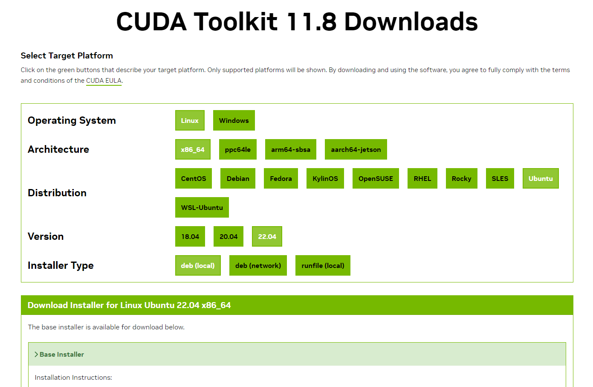

# Install XPose

XPose, the face detector model used for animal mode, is currently not working with MacOS or non NVIDIA graphic cards, and is not compatible with pytorch version 2.1.x which is the default version of today's Automatic1111 version v1.10.1. To allow animal mode to work correctly, you must downgrade your pytorch version to v2.0.1 that was built using cuda v1.18.  

You can find here the procedure to install XPose on your computer.

## Windows Users

### Microsoft Visual Studio Build Tools

First, you need to have the proper installation of the Microsoft Visual Studio Build Tools. Go to [Visual Studio 2019 Release History](https://learn.microsoft.com/en-us/visualstudio/releases/2019/history#release-dates-and-build-numbers) and download the Build Tools corresponding to latest version:  


> [!Note]
> Note that more recent versions of the Build Tools (Visual Studio 2022 17.10 and above) are not compatible with CUDA Toolkit 11.8. Even if you already have Visual Studio 2022 Build Tools installed you still have to download and install the 2019 version.  

In the installation dialog, select "Desktop development with C++" as shown in the image below (ensure that the version to be installed is the correct one) and click "Install":


At the end of the installation procedure, you should see a screen like the following:


### CUDA Toolkit 11.8

Then, you need to install the v11.8 CUDA Toolkit. Go to [NVIDIA CUDA Toolkit](https://developer.nvidia.com/cuda-11-8-0-download-archive) page and select your operating system configuration. You can either choose "exe (local)" or "exe (network)" but the latter will be faster as you don't need to install all NVIDIA packages. Download the installer and execute it.



When asked, choose custom install:


Then in the following dialog, unselect "Other Components" and "Driver Components":


Finally, under "CUDA", only select "Development" and "Runtime" and click "Next":


Click "Next" and "Finish" to end CUDA Toolkit installation.

### Automatic1111

Open the `stable-diffusion-webui/webui-user.bat` file and make the following changes:

If you're using `xformers`, adjust or add the following lines (if you're not using `xformers`, remove the `--xformers` flag in `COMMANDLINE_ARGS` and remove the `XFORMERS_PACKAGE` line):
```
set COMMANDLINE_ARGS=--skip-version-check --xformers
set TORCH_COMMAND=pip install torch==2.0.1+cu118 torchvision==0.15.2+cu118 --extra-index-url https://download.pytorch.org/whl/cu118
set XFORMERS_PACKAGE=xformers==0.0.22
```

As we have downgraded the pytorch version, to avoid unnecessary warnings at each launch of Automatic1111, we add the `--skip-version-check` flag to the command line arguments.

After these modifications, close Stable Diffusion WebUI if not done and restart it using the flags `--reinstall-torch` and `--reinstall-xformers` (if you're using `xformers`). These flags can then be removed for subsequent launches of Automatic1111.

If everything went well, you should be able to use animal mode in the `Live Portrait` tab.

## Linux Users

### GCC

Verify that you have `gcc` correctly installed by running the following command in a terminal:
```
gcc --version
```
If an error message displays, you need to install the development tools from your Linux distribution or obtain a version of gcc and its accompanying toolchain from the Web.

### CUDA Toolkit 11.8

Then, you need to install the v11.8 CUDA Toolkit. Go to [NVIDIA CUDA Toolkit](https://developer.nvidia.com/cuda-11-8-0-download-archive) page and select your operating system configuration. You can choose any of the "Installer Type" but note that you only need the CUDA Toolkit SDK to be installed, you can skip the driver installation if you've already done it.



At the end of the installation procedure, add the correct version of CUDA Toolkit to your PATH environment variable as described [here](https://docs.nvidia.com/cuda/cuda-installation-guide-linux/index.html#environment-setup) by replacing latest version of CUDA with 11.8 in folder paths: `/usr/local/cuda-11.8/`.

### Automatic1111

Open the `stable-diffusion-webui/webui-user.sh` file and make the following changes:

If you're using `xformers`, adjust or add the following lines (if you're not using `xformers`, remove the `--xformers` flag in `COMMANDLINE_ARGS` and remove the `XFORMERS_PACKAGE` line):
```
export COMMANDLINE_ARGS="--skip-version-check --xformers"
export TORCH_COMMAND="pip install torch==2.0.1+cu118 torchvision==0.15.2+cu118 --extra-index-url https://download.pytorch.org/whl/cu118"
export XFORMERS_PACKAGE="xformers==0.0.22"
```

As we have downgraded the pytorch version, to avoid unnecessary warnings at each launch of Automatic1111, we add the `--skip-version-check` flag to the command line arguments.

After these modifications, close Stable Diffusion WebUI if not done and restart it using the flags `--reinstall-torch` and `--reinstall-xformers` (if you're using `xformers`). These flags can then be removed for subsequent launches of Automatic1111.

If everything went well, you should be able to use animal mode in the `Live Portrait` tab.

## Installation logs

The building of the XPose OP dependency adds some logs in the `stable-diffusion-webui/extensions/sd-webui-live-portrait/logs` directory. If an error occurs during the extension installation, you may find useful information in the log files written in this folder.